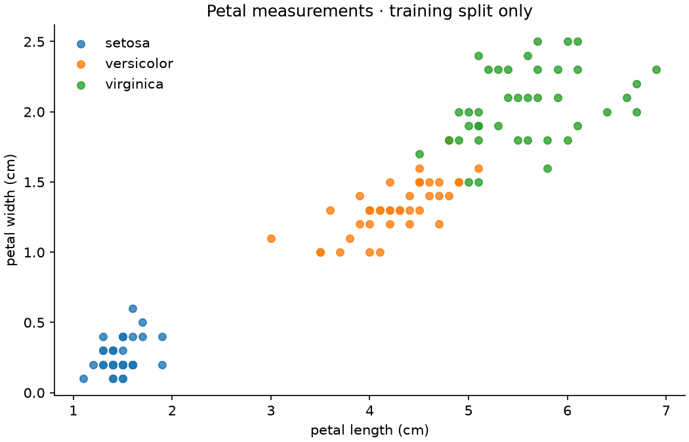

# Iris Classification Lab

An end-to-end introduction to supervised machine learning: explore measurements, establish a baseline, compare classifiers, and evaluate a selected model on held-out data.

[](https://github.com/canquesse/iris-classification-lab/actions/workflows/ci.yml)




## Why this project

The original repository started with one Iris exploration notebook. This version turns that first experiment into a reproducible workflow with a command-line interface, tests, comparison charts and an explicit evaluation protocol. The aim is to demonstrate the fundamentals clearly, including the ways a small experiment can mislead.

## Quick start

Python 3.12 is used for the checked-in results.

```sh
git clone https://github.com/canquesse/iris-classification-lab.git
cd iris-classification-lab
python3 -m venv .venv
source .venv/bin/activate
python -m pip install -c constraints.txt -e '.[dev]'
iris-lab train
iris-lab predict 5.1 3.5 1.4 0.2
python -m pytest -q
```

Windows activation: `.venv\Scripts\activate`. The dataset is bundled with scikit-learn; training does not download data or require credentials. Only load model artifacts you generated or trust.

## Evaluation protocol

1. Split 150 observations into 120 training and 30 test samples, stratified by species, with seed 42.
2. Compare a majority baseline, logistic regression, five-neighbor classification and a depth-limited random forest using five stratified training folds.
3. Keep scaling inside each estimator's pipeline so validation folds never influence preprocessing.
4. Select on training macro F1; then evaluate the selected model once on the held-out test set.
5. Save metrics, per-class results, confusion matrix and the fitted model.

The reference run selects logistic regression: **93.3% test accuracy**, versus **33.3%** for the majority baseline. Full training-fold results and test metrics are in [the experiment report](reports/README.md).

## Explore the work

| Path | Purpose |
| --- | --- |
| `notebooks/01_first_exploration.ipynb` | Original first experiment, retained as learning history |
| `notebooks/02_classification_workflow.ipynb` | Guided, reproducible walkthrough |
| `iris_lab/experiment.py` | Data split, model comparison, evaluation and plotting |
| `iris_lab/cli.py` | Training and prediction commands |
| `tests/` | Split, pipeline, artifact and input checks |
| `reports/` | Actual output from the documented experiment |

Run `jupyter lab` to explore the notebooks. Use `iris-lab train --seed 7 --output reports-seed-7` for another split; do not select a seed just because it improves the test score.

## What the results do and do not show

Iris is tiny, balanced and well studied. One test error moves accuracy by about 3.3 percentage points. This project demonstrates the learning workflow; it does not claim deployment readiness, calibrated confidence, novelty or generalization to field measurements.

Dataset reference: [UCI Iris](https://archive.ics.uci.edu/dataset/53/iris). Implementation reference: [scikit-learn datasets](https://scikit-learn.org/stable/modules/generated/sklearn.datasets.load_iris.html).
