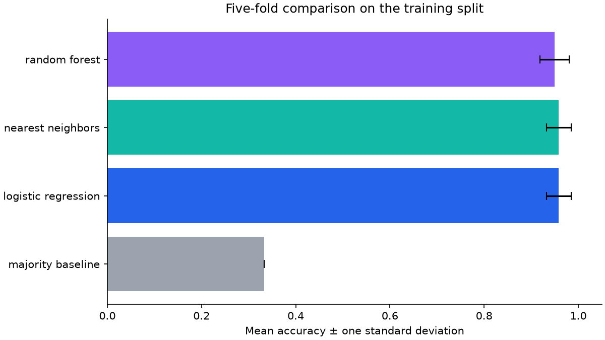
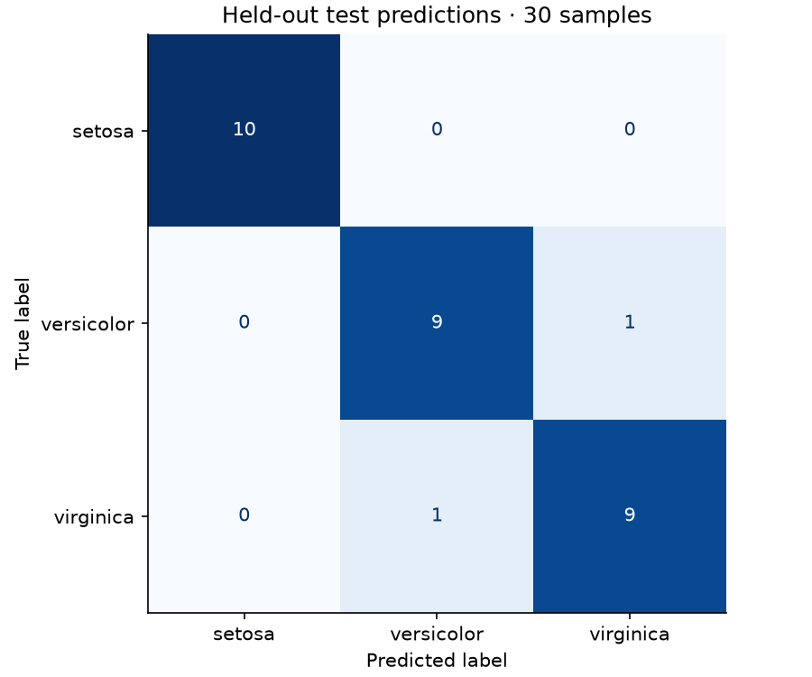

# Experiment results

Seed: 42. Training: 120 samples; held-out test: 30 samples.

Model selection uses five stratified training folds and macro F1. The test split is used only after selection.

| Model | CV accuracy | CV std | CV macro F1 |
| --- | ---: | ---: | ---: |
| majority_baseline | 0.333 | 0.000 | 0.167 |
| logistic_regression | 0.958 | 0.026 | 0.958 |
| nearest_neighbors | 0.958 | 0.026 | 0.958 |
| random_forest | 0.950 | 0.031 | 0.949 |

Selected: **logistic_regression**. Test accuracy: **0.933**; baseline: **0.333**.

This tiny, balanced dataset is an introduction to the workflow. A high score here does not establish performance on field measurements or other datasets.
